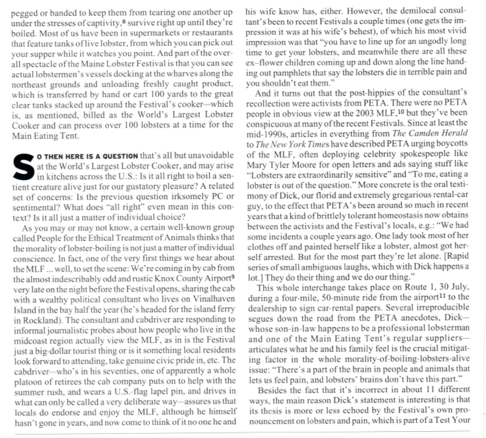

<h2>Table of Contents</h2>

<ul>
<li><a href="#orgheadline4">Definitions</a>
<ul>
<li><a href="#orgheadline1">Straw Man  Argument</a></li>
<li><a href="#orgheadline2">Weak Man Argument</a></li>
<li><a href="#orgheadline3">Steel Man Argument</a></li>
</ul>
</li>
<li><a href="#orgheadline5">Why Take the Other Side in an Argument</a></li>
<li><a href="#orgheadline12">Argument and Counter-Argument</a>
<ul>
<li><a href="#orgheadline6">Argument:</a></li>
<li><a href="#orgheadline7">Counter-Argument:</a></li>
<li><a href="#orgheadline8">Argument:</a></li>
<li><a href="#orgheadline9">Counter-Argument:</a></li>
<li><a href="#orgheadline10">Argument:</a></li>
<li><a href="#orgheadline11">Counter-Argument</a></li>
</ul>
</li>
</ul>

# Definitions

## Straw Man  Argument

I always think of the Straw Man from The Wizard of Oz, but that's not the real origin. In its simplest definition, straw man is the name of a logical fallacy, which means that if you carefully dissect the argument or statement, it doesn't make sense. Debaters invoke a straw man when they put forth an argument—usually something extreme or easy to argue against—that they know their opponent doesn't support. You put forth a straw man because you know it will be easy for you to knock down or discredit. It's a way of misrepresenting your opponent's position.

It's as if you took a flaming scarecrow, threw it onto the debate floor, yelled “Look, it's my opponent's dangerous straw man,” and then you appeared to save the day by dousing the flames with water. All while your opponent mutters, “That's not my straw man. What just happened?”

— Mignon Fogarty, [Grammar Girl: What Is a Straw Man Argument?](http://www.quickanddirtytips.com/education/grammar/what-is-a-straw-man-argument)

## Weak Man Argument

With a “weak man,” you don’t actually fabricate a position, but rather pick the weakest of the arguments actually offered up by people on the other side and treat it as the best or only one they have. &#x2026; [T]his is hardly illegitimate all the time, because sometimes the weaker argument is actually the prevalent one. Maybe the best arguments for Christianity are offered up by Thomas Aquinas or St. Augustine, but I doubt there are very many people who are believers because they read On Christian Doctrine. Probably this will be the case with some frequency, if only because the less complex or sophisticated an argument is, the easier it is for lots of people to be familiar with it. On any topic of interest, a three-sentence argument is unlikely to be very good, but it’s a lot more likely to spread.

— Julian Sanchez, [The Weak Man](http://www.juliansanchez.com/2009/07/01/the-weak-man/)

## Steel Man Argument

Steelmanning is the opposite of the strawman fallacy. A steelman argument occurs when one intentionally seeks the best form of the opponent's argument, or deriving the strongest possible position from their current arguments. Using this approach encourages pure discussion rather than leading to just another exchange of rehearsed or quietly Googled counterpoints and cheap cop-outs, demonstrates your knowledge of the discussion at hand, and basically makes you a better debater and a better person in general.

— [IssuePedia](http://issuepedia.org/Steel_man_argument)

# Why Take the Other Side in an Argument

I think steelmanning makes you a better person. It makes you more charitable, forcing you to assume, at least for a moment, that the people you’re arguing with, much as you ferociously disagree with them or even actively dislike them, are people who might have something to teach you. It makes you more compassionate, learning to treat those you argue with as true opponents, not merely obstacles. It broadens your mind, preventing us from making easy dismissals or declaring preemptive victory, pushing us to imagine all the things that could and might be true in this beautiful, strange world of ours. And it keeps us rational, reminding us that we’re arguing against ideas, not people, and that our goal is to take down these bad ideas, not to revel in the defeat of incorrect people.

— Chana Messinger, "Knocking Down a Steel Man: How to Argue Better"

He who knows only his own side of the case knows little of that. His reasons may be good, and no one may have been able to refute them. But if he is equally unable to refute the reasons on the opposite side, if he does not so much as know what they are, he has no ground for preferring either opinion&#x2026; Nor is it enough that he should hear the opinions of adversaries from his own teachers, presented as they state them, and accompanied by what they offer as refutations. He must be able to hear them from persons who actually believe them&#x2026;he must know them in their most plausible and persuasive form.

— John Stuart Mill, On Liberty (1859
)

# Argument and Counter-Argument

## Argument:

Angie Thomas derived the title of her debut novel, The Hate U Give, from a quote by rapper Tupac Shakur: “The hate u gave little infants fuck everybody.” This was Tupac’s philosophy, that from seeds of hate, hate sprouts. His philosophy grew into a movement: T.H.U.G.L.I.F.E. In many ways, Tupac saw himself as an activist giving voice to the voiceless through his music and his spoken word.

## Counter-Argument:

Tupac’s T.H.U.G.L.I.F.E philosophy, on the surface, seemed to be wrought by cynicism. In his song “Changes,” released posthumously, Tupac mourns that “some things’ll never change.” And yet he admonishes his listeners to make the changes themselves, not only as a means of survival but as a means of activism. He turned the word “thug” into a rallying cry. He reclaimed the word thug as a means of protest and as a reckoning between two consciousnesses. It is a means for transforming hate into something else…hope.
—Megan Pindling, “The Hate U Give When The Rainbow Isn’t Enough”

## Argument:

Let the rat race begin! This past week Amazon, the world’s largest online shopping retailer, unveiled plans to open a second North American headquarters as a counterpart to its base in Seattle. Well it’s not exactly a plan, more like a lottery that its dangling in front of every major city with a population over a million people. . . . If there is any city that’s well prepared to do battle, it’s New York. As far as potential goes, being the largest city and market in the country is sure to help. It also might help that Amazon has already made inroads in New York.  Just last week while I was mindlessly scrolling through my Facebook feed, I came across the news that Amazon announced its plans to open one of its notoriously cruel, gigantic distribution warehouses in Staten Island of all places. Apparently, it would be the first such facility in the state.

## Counter-Argument:

As expected a flurry of press releases from the offices of local and state politicians, including the governor, went out celebrating how wonderful the warehouse is going to be for the local and state economy. Not one of those press releases mentioned the fact that however “permanent” those jobs might be, not one of them will be protected by a union. They also made no mention of the cavalier use of union busting tactics as well as the unfair labor practice allegations made by workers in Amazon warehouses across the nation. Workers have been routinely harassed in a toxic anti-union culture that is pervasive in the company. Amazon has even fired its workers for attempting to unionize their shop. A well-known case took place in a Seattle warehouse back in 2001 when Amazon fired 850 workers amid a unionization drive.
Nor did those same politicians make any mention of the massive tax payer funded corporate welfare package that the New York State Economic Development Corporation (NYSEDC) was gifting to Amazon for its thoughtfulness in coming here. New Yorkers will be subsidizing Amazon in the form of a “tax credit” to the tune of $18 million—all for a company that is one of the wealthiest in the world.
—Amir Khafagy, “Amazon Auctions off Explotation and Gentrification to the Highest Bidder”

## Argument:

Beneficence, loyalty, protection, and justice are among the many moral considerations a person can extend to another being.2  There are three sorts of justifications for targeting a particular being with any moral consideration: (1) Even though the consideration is not owed to anyone or anything, there are some independent moral reasons for targeting the entity as the beneficiary of moral consideration; (2) The consideration is owed to  some other party but the target of the consideration is merely a third-party beneficiary; (3) The consideration is owed to  its intended target. It is this third sort of justification that interests me, since it picks out the status of moral standing .

## Counter-Argument

Any such argument for the moral standing of animals might seem too contingent and heavily conditioned to justify animals’ moral standing. Their moral standing seems only to come after persons adopt attitudes about the proper extent of community and the proper content of an environmental ethic.6  However, we should distinguish as much as possible between arguments for what it would take for people to treat animals as they ought from arguments for how people ought to treat animals. Let us take an appeal to dependencies as part of the second sort of argument.
—Andrew L. Cohen, “Dependent Relationships and the Moral Standing of Non-Human Animals”
z

## Argument / Counter Argument

— Consider the Lobster, David Foster Wallace
